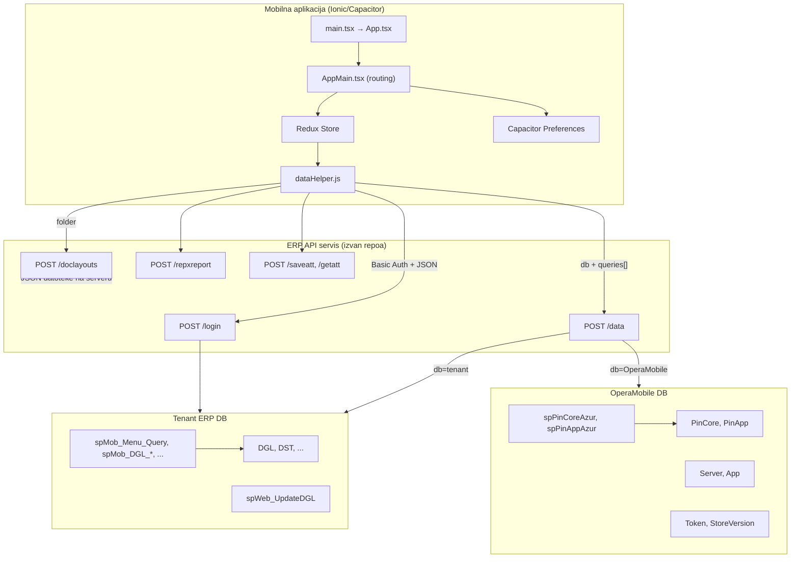
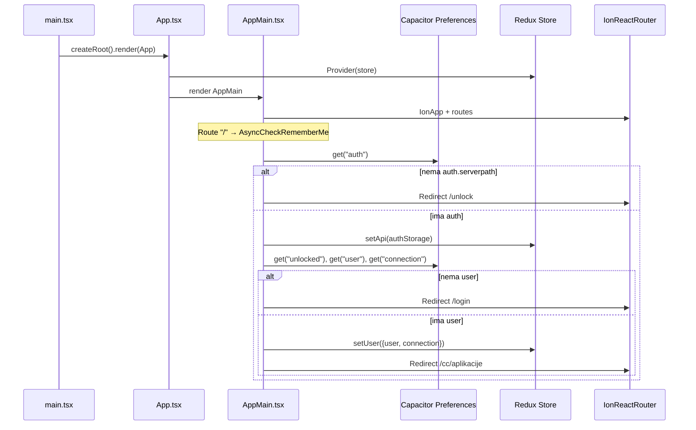
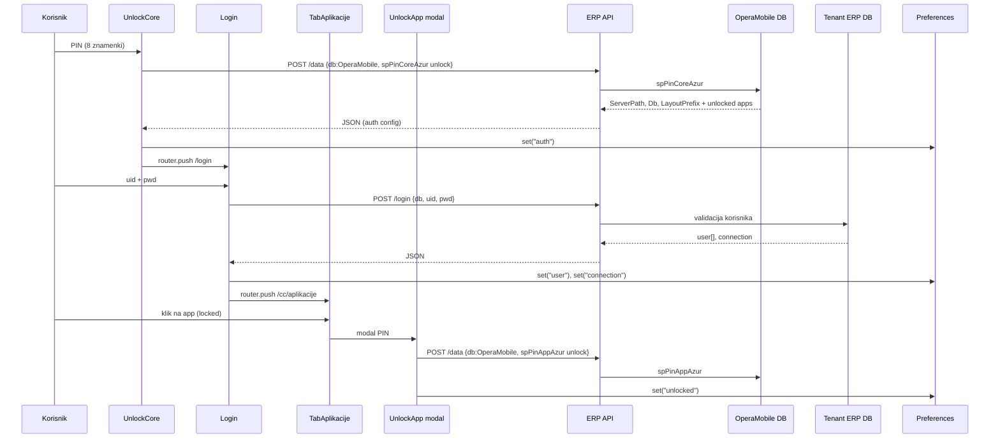
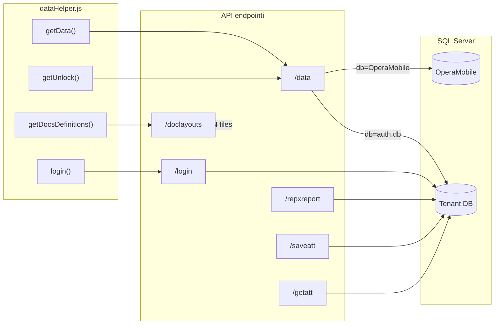
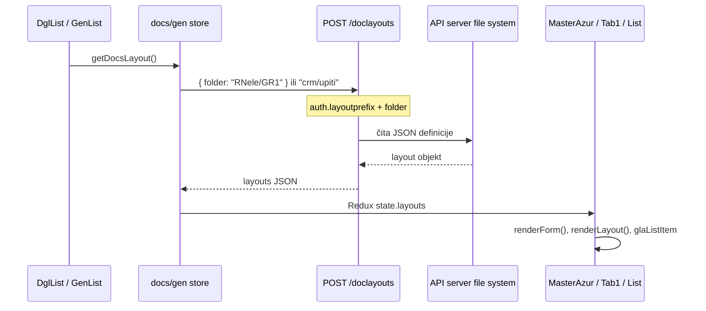

# Current Architecture

> **Status:** trenutno stanje, dokazano iz koda repozitorija i read-only SQL uvida u `OperaMobile`.
> **Metoda:** statička analiza koda + SQL MCP (`OperaMobile`, SQL Server 2019) + inspekcija lokalne kopije `MobLayoutsControls/`.
> **Napomena:** API backend (ASP.NET servis na `*/api`) **nije** u ovom repozitoriju; ponašanje endpointa je inferirano iz klijentskog koda i gdje god nije potvrđeno, tako je i označeno. Backend detalji koji blokiraju odluke su u [`OPEN_QUESTIONS.md`](OPEN_QUESTIONS.md).

---

## 1. Sažetak

Opera Mobile je **hybrid mobilna aplikacija** (Ionic React + Capacitor 6) koja služi kao klijent za **OperaOpus ERP**. Arhitektura je **dvoslojna baza**:

1. **`OperaMobile`** - centralni registar uređaja, PIN-ova, API servera i licenci aplikacija (11 tablica, 18 SP-ova u `dbo`).
2. **Tenant ERP baza** (npr. `ooMIDA_20230124`) - poslovni podaci, meni, dokumenti; pristup preko dinamičkih `spMob_*` procedura koje mobilni klijent poziva kroz generički `/data` endpoint.

Aplikacija koristi **tri paralelna UI modela**:

| Model | Putanja | Opis |
|-------|---------|------|
| Legacy servis moduli | `/servis/*` | Hardkodirani ekrani + fiksni SP-ovi (`spMob_DGL_RadniNalozi_*`) |
| Generički dokumenti (`dgl`) | `/docs/dgl/:sifdv` | JSON layout s API-ja `/doclayouts`, render dinamičkih formi |
| Generički moduli (`gen`) | `/gen/list/:app/:module` | Isti JSON-driven pristup, folder `{app}/{module}` |

**Ključni zaključak:** Značajan dio UI-ja (liste, forme, view, SP mapiranja) **može se mijenjati bez nove verzije aplikacije** putem JSON definicija na API serveru i SP-ova u tenant bazi. Rutiranje, tabovi i neki moduli i dalje zahtijevaju kod.

Verzija u `package.json`: **2.0.1** (`src/build-info.json` u repou pokazuje **2.0.5** - generira se pri buildu).

---

## 2. Tech stack

### 2.1 Runtime i framework

| Tehnologija | Verzija | Dokaz |
|-------------|---------|-------|
| React | ^18.2.0 | `package.json` |
| Ionic React | ^8.0.0 | `package.json`, `src/App.tsx` |
| React Router | ^5.3.4 | `package.json`, `src/AppMain.tsx` |
| Redux Toolkit | ^2.2.3 | `package.json`, `src/store/store.tsx` |
| TypeScript | ^5.1.6 | `package.json`, miješano s `.jsx` |
| Vite | ^5.0.0 | `package.json`, `vite.config.ts` |

### 2.2 Mobilna platforma

| Tehnologija | Verzija | Dokaz |
|-------------|---------|-------|
| Capacitor Core | ^6.0.0 | `package.json`, `capacitor.config.ts` |
| Capacitor Android | 6.0.0 | `package.json` |
| @capacitor/preferences | ^6.0.0 | Login/storage - `src/pages/auth/Login.tsx` |
| @capacitor/device | ^6.0.0 | Unlock - `src/pages/auth/UnlockCore.tsx` |
| @capacitor/push-notifications | ^6.0.0 | `src/pages/utils/PushNotificationsContainer.tsx` |
| @capacitor/camera, filesystem, file-picker | ^6.0.0 | Privitci/fotografije |

**Android:** `com.opera.mobile`, `webDir: dist` - `capacitor.config.ts`, `android/app/build.gradle`

### 2.3 Ostale biblioteke

| Biblioteka | Upotreba | Dokaz |
|------------|----------|-------|
| moment / react-moment | Format datuma | `src/utils/dataHelper.js`, liste |
| react-signature-canvas | Potpis | TabPotpis/Tab4 |
| uuid | Generiranje ID-eva | `package.json` |
| lodash | cloneDeep, utility | `src/utils/dataHelper.js` (transitivna ovisnost, **nije** direktno u `dependencies`) |
| ionicons | ^7.0.0 | UI ikone |

### 2.4 Testiranje i alati

- **Vitest** + Testing Library - `package.json`, `vite.config.ts`
- **Cypress** ^13.5.0 - `cypress.config.ts`
- **ESLint** ^8.35.0 - `.eslintrc.js`
- **Sass** - `src/theme/custom.scss`

### 2.5 Backend (izvan repozitorija)

- REST API na putanjama poput `https://erp.svamplus.hr/testapi/api` - `src/constants.ts`, tablica `OperaMobile.dbo.Server`
- SQL Server 2019 - potvrđeno MCP konekcijom

---

## 3. Arhitektura projekta

### 3.1 Dijagram arhitekture



### 3.2 Struktura foldera

```
ERP-IONIC7/
├── src/
│   ├── main.tsx              # Ulazna točka React DOM
│   ├── App.tsx               # Redux Provider + AppMain
│   ├── AppMain.tsx           # Ionic router, rute, bootstrap auth
│   ├── constants.ts          # Default API URL (SERVICE_DOMAIN)
│   ├── components/           # Menu, Header, PrivateRoute, Search, Spinner
│   ├── hooks/                # useFetchData, usePhotoGallery, useShowRepx
│   ├── store/                # rootReducer, configureStore
│   ├── utils/
│   │   ├── dataHelper.js     # Svi API pozivi (fetch)
│   │   └── data/constants.js # Endpoint konstante
│   └── pages/
│       ├── auth/             # UnlockCore, Login, auth Redux slice
│       ├── core/             # Kontrolni centar, moduli, cc store
│       ├── servis/           # RadniNalozi, DnevniIzvjestaj (legacy)
│       ├── dgl/              # Generički dokumenti po sifdv
│       ├── gen/              # Generički moduli po app/module
│       └── utils/            # PushNotifications (demo)
├── android/                  # Capacitor Android projekt
├── MobLayoutsControls/       # Lokalna snimka JSON layouta (v. §7.7)
├── scripts/write-build-info.cjs
├── capacitor.config.ts
└── vite.config.ts
```

### 3.3 Redux moduli

| Slice | Datoteka | Odgovornost |
|-------|----------|-------------|
| `auth` | `src/pages/auth/store/index.jsx` | api, db, layoutprefix, user, connection |
| `core.cc` | `src/pages/core/cc/store/index.jsx` | apps meni, selectedApp/Module, unlocked |
| `servis.*` | `src/pages/servis/store/index.ts` | dnevniIzvjestaj, radniNalozi |
| `docs` | `src/pages/dgl/store/index.jsx` | dgl modul (layouts, list, filter, CRUD) |
| `gen` | `src/pages/gen/store/index.jsx` | gen modul (layouts, list, CRUD) |

**Napomena:** `docs` reducer je u `dgl/store` ali se u rootReducer-u importira kao `docs` - `src/store/rootReducer.ts`.

### 3.4 Rutiranje (AppMain.tsx)

| Ruta | Komponenta | Zaštita |
|------|------------|---------|
| `/` | AsyncCheckRememberMe (bootstrap) | javna |
| `/unlock` | UnlockCore | javna |
| `/login` | Login | javna |
| `/cc/*` | KontrolniCentarTabs | PrivateRoute |
| `/modules/:app?` | Modules | PrivateRoute |
| `/servis/dnevniizvjestaj` | DnevniIzvjestajList | PrivateRoute |
| `/servis/radninalozi/:sifdv` | RadniNaloziList | PrivateRoute |
| `/docs/dgl/:sifdv` | DglList | PrivateRoute |
| `/docs/dgltabs` | DglMainTabs | PrivateRoute |
| `/gen/list/:app/:module` | GenList | PrivateRoute |
| `/gen/tabs` | GenMainTabs | PrivateRoute |
| `/pushup` | PushNotificationsContainer | PrivateRoute |

---

## 4. Pokretanje i lifecycle aplikacije

### 4.1 Dijagram lifecycle-a



### 4.2 Ulazne točke

1. **`index.html`** → `<script src="/src/main.tsx">`
2. **`src/main.tsx`** → mount `App`
3. **`src/App.tsx`** → `Provider` + `AppMain`
4. **`src/AppMain.tsx`** → routing + cold start logika

### 4.3 Cold start (`AppMain.tsx`)

Funkcija `checkRememberMe()` (wrapana u `AsyncCheckRememberMe` sa SplashScreen odgodom 1s):

1. Čita `Preferences` ključ **`auth`** - mora imati `serverpath` (`getAuthStorage`, linija 138–143)
2. `dispatch(setApi(authStorage))` - postavlja API URL i tenant DB
3. Čita **`unlocked`** → `setUnlockedApp` (otključane aplikacije)
4. Čita **`user`** i **`connection`** - ako nema usera → `/login`, inače → `/cc/aplikacije`

**Dokaz:** `src/AppMain.tsx` linije 59–87, 152–154

### 4.4 Capacitor lifecycle

- `App.addListener('appUrlOpen')` - registriran ali prazan handler - `AppMain.tsx:55–57`
- Push notifikacije - zasebna demo stranica, nije integrirana u login/unlock flow

---

## 5. Login, autentikacija i autorizacija

### 5.1 Dijagram login flow-a



### 5.2 Faze autentikacije

#### Faza 1: Core unlock (`UnlockCore.tsx`)

- Korisnik unosi 8-znamenkasti PIN
- Poziv `getUnlock()` → `POST {SERVICE_CORE_DOMAIN}/data` s **`db: 'OperaMobile'`** i SP **`spPinCoreAzur`** (`action: unlock`)
- Parametri uključuju podatke uređaja: `Device.getInfo()`, `Device.getId()` - `UnlockCore.tsx:55–76`
- Rezultat se sprema u **`auth`** Preferences i Redux `setApi`

**SQL dokaz** (`spPinCoreAzur`, OperaMobile): vraća `ServerPath`, `Pin`, `Db`, `Admin`, `LayoutPrefix` iz `PinCore` + `Server`; drugi result set - kodove aplikacija iz `PinApp`/`App`.

#### Faza 2: ERP login (`Login.tsx`)

- Request: `{ uid, pwd }` → `login()` → `POST auth.api + '/login'` s `{ db: auth.db, uid, pwd }`
- Response: `json.user[0]` + `json.connection`
- Spremanje: Preferences ključevi **`user`**, **`connection`**
- Redux: `setUser(json)`

**Dokaz:** `src/pages/auth/Login.tsx:88–111`, `src/utils/dataHelper.js:266–288`

#### Faza 3: App unlock (`UnlockApp.jsx`)

- Za zaključanu aplikaciju u kontrolnom centru
- SP **`spPinAppAzur`** (`action: unlock`, `appCode`, `deviceUuid`, `db`)
- Rezultat u Preferences **`unlocked`** + Redux `unlockApp`

### 5.3 Session / token pohrana

| Ključ (Preferences) | Sadržaj | Postavlja |
|---------------------|---------|-----------|
| `auth` | serverpath/api, db, layoutprefix | UnlockCore, Login modal |
| `user` | ERP korisnik (korime, name, grupa, sifosobe, sifgrupe, ...) | Login |
| `connection` | server, database info | Login |
| `unlocked` | lista otključanih app kodova | UnlockApp |

**localStorage:** `darkMode` - `TabPostavke.tsx`, `Login.tsx`

**JWT/OAuth:** **Nije implementirano** u klijentu. API koristi hardkodirani **`Authorization: Basic dGVzdDoxMjM=`** (test:123) u svim requestima - `src/utils/dataHelper.js:116`.

**RefreshToken:** kolona postoji u `PinCore.RefreshToken` i `Token.RefreshToken`, ali mobilni klijent **ne koristi** refresh token flow u analiziranom kodu.

### 5.4 Odjava

- `logOut` async thunk - briše samo Preferences **`user`**, Redux `setUser(null)` - `src/pages/auth/store/index.jsx:4–17`
- **`auth`**, **`connection`**, **`unlocked`** ostaju - korisnik ne mora ponovno unositi core PIN
- Redirect na `/login` - `TabAplikacije.jsx:108–110`, `Menu.jsx:97–99`

### 5.5 Autorizacija i prava

| Razina | Mehanizam | Dokaz |
|--------|-----------|-------|
| Ruta | `PrivateRoute` - provjera `state.auth.user` | `src/components/PrivateRoute.tsx:7–18` |
| Aplikacija | `app.unlocked` flag + PIN (`spPinAppAzur`) | `TabAplikacije.jsx:64–69`, `UnlockApp.jsx` |
| Meni/moduli | SP **`spMob_Menu_Query`** s `korIme` | `src/pages/core/cc/store/index.jsx:4–15` |
| Dokumenti | SP-ovi s `korime`, `sifosobe`; filter `samomoje` | npr. `gen/store/index.jsx:34–44` |
| Layout po grupi | Folder `{sifdv}/{sifgrupe}` fallback `{sifdv}` | `dgl/store/index.jsx:119–132` |
| UI vidljivost | JSON polja `visiblefield`, `tabpotpisvisible`, `editable` | `Tab1.jsx:89–90`, `MainTabs.tsx:46–60` |

**Prilagodbe po korisniku/tvrtki:** tenant DB + JSON layout prefix (`LayoutPrefix` iz PinCore, npr. `"svam"`) + grupa korisnika (`sifgrupe`).

---

## 6. API komunikacija

### 6.1 Dijagram: mobilna aplikacija → API → baza



### 6.2 Endpoint inventar

| Endpoint | Metoda | Funkcija | Body (sažeto) |
|----------|--------|----------|---------------|
| `{auth.api}/data` | POST | `getData()` | `{ db, queries: [{query, params, commandtype, tablename, loadoptions}], printing?, mails? }` |
| `{auth.api}/login` | POST | `login()` | `{ db, uid, pwd }` |
| `{SERVICE_CORE_DOMAIN}/data` | POST | `getUnlock()` | `{ db: 'OperaMobile', queries: [...] }` |
| `{auth.api}/doclayouts` | POST | `getDocsDefinitions()` | `{ folder: 'prefix/sifdv' \| 'app/module' }` |
| `{auth.api}/gridToPdf` | POST | `getData(type:'printing')` | isto kao /data |
| `{auth.api}/repxreport` | POST | `getReport()` | `{ db, id, reportname, parameters, mailTo, type }` |
| `{auth.api}/saveatt` / `getatt` | POST | attachments | `{ db, parameters }` / `{ db, id }` |
| `{SERVICE_DOMAIN}/layouts` | POST | `getDefinitions()` | (prazan body) - **vjerojatno legacy, rijetko korišten u kodu; je li stvarno još aktivan na backendu nije potvrđeno** |
| `{SERVICE_DOMAIN}/base64frompath` | POST | `getFile()` | `{ path }` |
| `{SERVICE_DOMAIN}/sendmail` | POST | `sendMail()` | `{ db, ... }` |
| `{SERVICE_DOMAIN}/directpdf` | POST | `getDirectPdf()` | props |
| `{SERVICE_DOMAIN}/rndcrypt` | POST | `getDecriptedData()` | props |

**Konstante:** `src/utils/data/constants.js`, default domena `src/constants.ts:3–5`

### 6.3 Request/response model (`getData`)

```javascript
// src/utils/dataHelper.js:99-122
{
  db: auth.connection.database || DATABASE,
  queries: [{
    query: "spMob_...",      // ime SP ili SQL
    params: { ... },
    commandtype: "sp" | "text",
    tablename: "...",
    loadoptions: "..."
  }]
}
```

**Response:** JSON; za više result setova koristi se `table1`, `table2`, ... - npr. `getMenu.fulfilled` → `action.payload.table1`, `table2` - `core/cc/store/index.jsx:96–106`.

**Error handling:** `response.status != 200` → `throw(data)` - `dataHelper.js:136–138`. Nema globalnog interceptora; komponente prikazuju `IonAlert` lokalno.

### 6.4 Konfiguracija URL-ova

| Izvor | Prioritet | Dokaz |
|-------|-----------|-------|
| `OperaMobile.dbo.Server.ServerPath` | Nakon core unlock (via API) | SQL + `PinCore.ServerId` |
| `Preferences auth.serverpath` | Persistirano | `AppMain.tsx:65` |
| `src/constants.ts` SERVICE_DOMAIN | Fallback/dev default | `https://erp.svamplus.hr/testapi/api` |
| Login modal | Ručna promjena API + DB | `Login.tsx:119–134` |

**Serveri u bazi (primjer):** SVAM, MIDA, MEDIVA, Zaštita Jukić, Ruve, MBFRIGO, ASURA, Adriateh, Jasika - MCP upit na `OperaMobile.dbo.Server`.

---

## 7. Dinamičke definicije i JSON-driven UI

### 7.1 UI se djelomično definira izvan aplikacije

Aplikacijski kod (`src/`) **ne sadrži** JSON layout datoteke (pretraga `*.json` - samo build-info, manifest, cypress fixtures). Layouti dolaze s API-ja **`/doclayouts`**. Lokalna snimka tih layouta postoji u `MobLayoutsControls/` na razini repozitorija - v. §7.7.

### 7.2 Tok učitavanja layouta



**Dokaz - učitavanje:**

- `dgl/store/getDocsLayout` - folder `${sifdv}/${sifgrupe}`, fallback `${sifdv}` - `src/pages/dgl/store/index.jsx:115–133`
- `gen/store/getDocsLayout` - folder `${app}/${module}` - `src/pages/gen/store/index.jsx:121–131`
- `getDocsDefinitions()` - `src/utils/dataHelper.js:458–505`; prefix iz `auth.layoutprefix`

### 7.3 JSON struktura (inferirano iz renderera)

| JSON ključ | Namjena | Renderer |
|------------|---------|----------|
| `glaListItem` / `dglListItem` | Lista stavki | `GenList.jsx:149`, `dgl/List.jsx:169` |
| `glaViewItems` / `dglViewItems` | Detalj grupe | `TabInfo.jsx:78`, `dgl/tabs/Tab1.jsx:83` |
| `glaEditItems` / `dglEditItems` | Forme | `MasterAzur.jsx:215` |
| `dstListItem`, `dstEditItems` | Stavke dokumenta | `TabStavke.jsx`, `DetailAzurNew.jsx` |
| `queries.core.settings` | SP za postavke | `gen/store/getSettings:10` |
| `queries.gla.list`, `.azur`, `.filterdefaults`, `.statusi` | SP mapiranje | `gen/store/index.jsx` |
| `properties.signatureTextSelectField`, `reportName` | Potpis/REPX | `TabPotpis.jsx`, `Tab4.jsx` |
| `visiblefield` | Uvjetni prikaz grupe | `TabInfo.jsx:84–86` |

### 7.4 Tipovi form kontrola (MasterAzur)

| `item.type` | Ponašanje | Dokaz |
|-------------|-----------|-------|
| `date` | DatePicker modal | `MasterAzur.jsx:218` |
| `simple` / `advanced` | Search modal → SP iz `queries.gla.sifarnici` | `MasterAzur.jsx:219`, `search/simple/search.jsx` |
| `memo` | Textarea | `MasterAzur.jsx:220` |
| `text` | IonInput | `MasterAzur.jsx:221` |

### 7.5 Meni aplikacija (iz baze, ne iz JSON-a)

- **`spMob_Menu_Query`** u **tenant DB** vraća aplikacije (`table1`) i module (`table2`)
- Frontend spaja: `item.items = [{ title: 'Moduli', items: menus }]` - `core/cc/store/index.jsx:101–106`
- Navigacija modula: `module.url` - `Modules.tsx:59–61`

**Aplikacije u OperaMobile.App:** servis-mobile, crm-mobile, hrm-mobile, bi-mobile, wms-mobile, demo-mobile, rmk-mobile - MCP upit.

### 7.6 Što i dalje zahtijeva novu verziju aplikacije

- Nove rute u `AppMain.tsx`
- Novi tabovi u `MainTabs.tsx`
- Hardkodirani servis moduli (`/servis/*`)
- Novi tipovi form kontrola u MasterAzur
- Push integracija u produkcijski flow

### 7.7 `MobLayoutsControls/` - lokalna snimka layouta

Ovo su nalazi iz inspekcije lokalne kopije `MobLayoutsControls/` na razini repozitorija (nije unutar `src/`, do sada nije bila pod Git kontrolom):

- Lokalna kopija sadrži **762 datoteke ukupno**, od čega **757 JSON datoteka** (razlika su ne-JSON datoteke poput `TestPDF/sample.pdf`); kopija je **bajt-identična** kopiji na `\\operaweb\c$\inetpub\wwwroot\Opera\MobLayoutsControls`.
- Taj centralni folder na `operaweb` posužuje **samo** tenante koji koriste `erp.svamplus.hr` kao API server.
- Klijenti s **vlastitim API serverom** (npr. Zaštita Jukić, Ruve - v. §6.4 popis servera) imaju **zasebne kopije layouta koje nisu obuhvaćene ovom snimkom** i moraju se analizirati odvojeno, po serveru.
- Sustav layouta **trenutno nema Git povijest ni pouzdan rollback mehanizam** - promjene na `operaweb` ili klijentskim serverima nisu praćene.
- Pronađeni su ručni `.bak` fajlovi i backup folderi unutar strukture (npr. "ne diraj - mediva", "v0,1 JSON") - znak ad-hoc verzioniranja bez alata.
- Od 757 JSON datoteka, **34 nisu validan strogi JSON** (npr. trailing commas, komentari ili slični odmaci od specifikacije - točan uzrok nije klasificiran po datoteci).
- Postojeći backend očito **tolerira barem dio** tih 34 datoteke u produkciji (aplikacija za te tenante radi), ali **točno ponašanje parsera na backendu nije potvrđeno** jer backend kod nije u ovom repozitoriju - v. `OPEN_QUESTIONS.md`.
- **Layouti još nisu odobreni kao deploy source of truth** za Expo migraciju - tretiraju se prvo kao verzionirana snimka za analizu, ne kao izvor koji se automatski deploya (v. `DECISION_LOG.md`).
- **Nije potvrđeno** da su svi produkcijski layouti dostupni ovom snimkom - pokriveni su samo tenanti na centralnom `erp.svamplus.hr` serveru.

---

## 8. State management i lokalna pohrana

### 8.1 Redux

- **Store:** `configureStore({ reducer: createReducer() })` - `src/store/store.tsx`
- **Async:** `createAsyncThunk` u svakom modulu
- **Logout reset:** komentiran `state = undefined` - `rootReducer.ts:22–24` (store se **ne** resetira potpuno)

### 8.2 Capacitor Preferences (persistent)

| Ključ | Tip |
|-------|-----|
| auth | API konfiguracija |
| user | ERP korisnik |
| connection | DB konekcija |
| unlocked | Otključane aplikacije |

### 8.3 localStorage

- `darkMode` - boolean JSON

### 8.4 Cache i sinkronizacija

- **Nema** offline cache sloja (SQLite, IndexedDB sync)
- **Nema** explicit cache za API odgovore
- Liste se osvježavaju na pull-to-refresh i `useIonViewWillEnter` (dgl List)
- Pretraga je **klijentska** nad `originaldata` - `gen/store/setSearchText`, `dgl/store/setSearchText`
- **Nema** background sync / queue za offline CRUD

---

## 9. Baza podataka i veza s aplikacijom

### 9.1 OperaMobile - tablice

| Tablica | Svrha | Ključna polja |
|---------|-------|---------------|
| `App` | Registar mobilnih aplikacija | AppId, Code, Name |
| `Server` | API endpointi po klijentu | ServerId, Name, ServerPath |
| `PinCore` | Core licenca / uređaj | Pin, ServerId, Db, LayoutPrefix, DeviceUuid, RefreshToken |
| `PinApp` | Licenca po aplikaciji | Pin, AppId, PinCoreId, Db, Active |
| `Token` | Tokeni (admin/alternativa) | Pin, ServerId, RefreshToken, Korisnik |
| `StoreVersion` | Verzije u store-u | Platform, Version, NewVersionAvailable |
| `AppAccessLog` | Log pristupa | Pin, Db, ServerPath, JsonData |
| `LogPages` | Log stranica | - |
| `SpPinCoreAzur_ParLog` | Audit parametara SP | - |
| `SpPinAppAzur_ParLog` | Audit parametara SP | - |
| `SpPinCoreQuery_ParLog` | Audit parametara SP | - |

### 9.2 OperaMobile - stored procedure (korištene iz aplikacije)

| SP | Poziv iz | Akcija |
|----|----------|--------|
| `spPinCoreAzur` | `UnlockCore.tsx` | `action=unlock` - registracija uređaja |
| `spPinAppAzur` | `UnlockApp.jsx` | `action=unlock` - otključavanje app |

### 9.3 OperaMobile - SP-ovi u bazi (ne pozivaju se iz analiziranog klijentskog koda)

`spPinCoreQuery`, `spPinCoreAdminAzur`, `spPinAppAdminAzur`, `spTokenAzur`, `spServerQuery`, `spStoreVersionQuery`, `spAppAccessLog`, `spLogPagesAzur`, `spResetCoreAzur`, `spRepxLicenceQuery`, `spVirmaniZbirno` - MCP `INFORMATION_SCHEMA.ROUTINES`

### 9.4 Tenant ERP - SP-ovi referencirani u kodu

| SP | Modul | Datoteka |
|----|-------|----------|
| `spMob_Menu_Query` | Core meni | `core/cc/store/index.jsx` |
| `spMob_DGL_RadniNalozi_Query` | Radni nalozi | `servis/RadniNalozi/store` |
| `spMob_DGL_RadniNalozi_Azur` | Radni nalozi | isto |
| `spMob_DST_RadniNalozi_Azur` | Radni nalozi stavke | isto, gen, dgl |
| `spMob_DGL_DnevniIzvjestaj_Query` | Dnevni izvještaj | `servis/DnevniIzvjestaj/store` |
| `spMob_DGL_Azur` | Potpis, komentar | gen, dgl, servis stores |
| `spMob_DGL_Query` | Gen modul | `gen/store/index.jsx` |
| `spMob_DGL_Sifarnici` | Šifrarnici | `DnevniIzvjestaj/tabs/Tab1.jsx`, search |
| `spMob_DST_Ser` | Servis stavke | `search/searchser.tsx` |
| `spMob_ArtiklStanje_Query` | Artikl stanje | `search/simple/search.jsx` |
| `spMob_ZJUKIC_DST_Azur` | Custom klijent | gen, dgl stores |
| `spWeb_UpdateDGL` | Web update DGL | servis, dgl stores |

**Napomena:** `spMob_*` procedure **nisu** u bazi `OperaMobile` - nalaze se u tenant ERP bazama. MCP pristup imao je samo `OperaMobile`.

**Dodatno o SP-ovima koji postoje ali se ne pozivaju iz klijenta:**

- `spStoreVersionQuery` postoji u bazi (§9.3), ali klijent ga **ne poziva** - force update mehanizam nije implementiran u aplikaciji.
- `PinCore` ima kolonu `PushRegistrationId` koja podržava push registraciju, ali mobilni klijent **ne šalje** taj podatak tijekom core unlock flowa (§5.2) - podrška je parcijalna, samo na strani baze.

### 9.5 Mapiranje PinCore → API

Primjer podataka (MCP):

```
PinCoreId=328, ServerId=17, Db=ooMIDA_20230124, LayoutPrefix=svam
ServerId=17 → ServerPath=https://erp.svamplus.hr/testapi/api
```

---

## 10. Glavni poslovni flowovi

### 10.1 Flow: Cold start → rad s dokumentom (dgl)

1. `/` → provjera Preferences → `/unlock` | `/login` | `/cc/aplikacije`
2. `getMenu()` → `spMob_Menu_Query` → prikaz app grid
3. Korisnik odabere app → `/modules` → odabere modul → `module.url` (npr. `/docs/dgl/RNele`)
4. `DglList.initLoad`: `setSifDv` → `getDocsLayout` → `getSettings` → `getFilterDefaults` → `getStatuses`
5. `getList` → SP iz `layouts.queries.dgl.list`
6. Klik na stavku → `getListItem` → učitava DST → `/docs/dgltabs`
7. Edit → `MasterAzur` renderira `dglEditItems` → `saveGla` → SP iz `layouts.queries.gla.azur`

### 10.2 Flow: Radni nalozi (legacy servis)

1. Meni → modul s URL `/servis/radninalozi/:sifdv`
2. `setSifDv` → hardkodirani `spMob_DGL_RadniNalozi_Query`
3. Detalj → `spMob_DGL_RadniNalozi_Query action=getDet`
4. CRUD stavki → `spMob_DST_RadniNalozi_Azur`
5. Potpis → `spMob_DGL_Azur action=insertSignature` + `getReport` (REPX)

### 10.3 Flow: Gen modul (CRM upiti)

1. `/gen/list/:app/:module` - npr. `crm/upiti`
2. Layout folder `crm/upiti` s API-ja
3. CRUD preko `layouts.queries.gla.*` - SP imena **u JSON-u**, ne u kodu

### 10.4 Flow: Privitci

- `getPrivitci` → SP iz `layouts.queries.dgl.prilozi`
- Upload: `saveAttachments` → `/saveatt`
- Download: `getAttachemnt` → `/getatt`
- Kamera: `@capacitor/camera`, `@capawesome/capacitor-file-picker` - `FilesAdd.tsx`, `usePhotoGallery.ts`

### 10.5 Flow: Ispis (REPX)

- `getReport()` → `/repxreport` s `reportName` iz layout `properties`
- Potpis tab: email + PDF - `TabPotpis.jsx`, `Tab4.jsx`

---

## 11. Build i deployment

### 11.1 NPM skripte

| Skripta | Akcija |
|---------|--------|
| `dev` | `vite` dev server |
| `prebuild` / `build` | `write-build-info.cjs` → `tsc` → `vite build` |
| `preview` | Vite preview |
| `test.unit` | vitest |
| `test.e2e` | cypress run |

**Dokaz:** `package.json:6–14`

### 11.2 Build info

`scripts/write-build-info.cjs` generira `src/build-info.json`:

```json
{ "buildDate": "DD.MM.YYYY. HH:mm", "version": "<package.json version>" }
```

Prikazuje se u UnlockCore, TabAplikacije, Menu, TabPostavke.

### 11.3 Vite konfiguracija

- Plugini: `@vitejs/plugin-react`, `@vitejs/plugin-legacy` (stari Android WebView)
- **Nema** env-specifičnih `.env` datoteka u repou (`.gitignore` spominje `.env.*`)
- API URL hardkodiran u `constants.ts`

### 11.4 Android deployment

```bash
npm run build
npx cap sync android
# Android Studio → build APK/AAB
```

| Parametar | Vrijednost | Datoteka |
|-----------|------------|----------|
| applicationId | com.opera.mobile | `android/app/build.gradle:7` |
| versionCode | 1 | `android/app/build.gradle:10` |
| versionName | 1.0 | `android/app/build.gradle:11` |
| minifyEnabled | false | release build |
| google-services | FCM push | `google-services.json` |

**Napomena:** `package.json` version (2.0.1) ≠ Android `versionName` (1.0) - verzioniranje nije usklađeno.

### 11.5 Environment varijable

- **Nema** Vite `VITE_*` env varijabli u kodu
- Konfiguracija isključivo: `constants.ts`, Preferences `auth`, OperaMobile `Server`/`PinCore`

---

## 12. Tehnički dug i problematična mjesta

> Sigurnosni i strukturni rizici s procjenom vjerojatnosti/utjecaja i vlasnikom su u [`KNOWN_RISKS.md`](KNOWN_RISKS.md). Ovdje su samo tehničke činjenice koje ih dokazuju.

| Problem | Dokaz |
|---------|-------|
| Miješani JS/TS bez konzistentne migracije | `.jsx` store-ovi, `.tsx` komponente |
| Tri paralelna modula (servis/dgl/gen) s dupliciranim logikom | stores, MasterAzur kopije |
| `lodash` korišten ali nije direktna dependency | `package.json` vs `dataHelper.js:19` |
| `useFetchData` gutaju greške bez re-throw | `useFetchData.js:30–36` - Login može dobiti `undefined` |
| Redux store se ne resetira na logout | `rootReducer.ts:22–24` |
| Hardkodirani naslovi ("CRM - Upiti") | `GenList.jsx:240` |
| Push notifikacije - Enappd demo, nije produkcijski | `PushNotificationsContainer.tsx` |
| `TabPostavke` reset gumbi bez implementacije | `TabPostavke.tsx:113–117` |
| Zakomentiran legacy kod (Mediva moduli) | `AppMain.tsx:18–19`, `199–200` |
| Android verzija ne prati npm verziju | `build.gradle` vs `package.json` |
| Nema README / CI pipeline u repou | pretraga |
| Cypress test - samo placeholder | `cypress/e2e/test.cy.ts` |

**Problematična mjesta:**

- **`checkRememberMe` u AppMain** vraća JSX iz async funkcije kroz custom HOC - nestandardni pattern, teško održavanje
- **`gen/store` vs `docs` naming** - `selectDocs` u gen modulu, zbunjujuće
- **Duplicirani thunk tipovi** - npr. `'gen/getList'` korišten dvaput u gen store
- **Ovisnost o API transformaciji** - klijent očekuje `serverpath`, SQL vraća `ServerPath` (transformacija na API-ju - nije verificirano u repou)

---

## 13. Nepoznanice

Sva otvorena pitanja o backend ponašanju, layoutima i infrastrukturi su konsolidirana u [`OPEN_QUESTIONS.md`](OPEN_QUESTIONS.md), ne ovdje, da se izbjegne dupliciranje.

---

## 14. Preporučeni redoslijed datoteka za ručno proučavanje

### 14.1 Ulaz i infrastruktura (1. dan)

1. `package.json` - ovisnosti i verzije
2. `src/main.tsx` → `src/App.tsx` → `src/AppMain.tsx` - bootstrap i routing
3. `src/constants.ts` + `src/utils/data/constants.js` - API endpointi
4. `src/utils/dataHelper.js` - **centralni** API sloj
5. `src/store/rootReducer.ts` + `src/store/store.tsx` - Redux struktura
6. `capacitor.config.ts` + `android/app/build.gradle` - mobilni build

### 14.2 Autentikacija (2. dan)

7. `src/pages/auth/UnlockCore.tsx` - core PIN
8. `src/pages/auth/Login.tsx` - ERP login
9. `src/pages/auth/store/index.jsx` - auth state
10. `src/components/PrivateRoute.tsx` - zaštita ruta
11. `src/pages/core/cc/components/UnlockApp.jsx` - app PIN
12. SQL: `OperaMobile.dbo.spPinCoreAzur`, `spPinAppAzur` (MCP/SMS)

### 14.3 Navigacija i moduli (3. dan)

13. `src/pages/core/cc/TabAplikacije.jsx` - kontrolni centar
14. `src/pages/core/cc/store/index.jsx` - meni (`spMob_Menu_Query`)
15. `src/pages/core/modules/Modules.tsx` - lista modula
16. `src/components/Menu.jsx` - side menu

### 14.4 JSON-driven moduli (4.–5. dan)

17. `src/pages/dgl/store/index.jsx` - **referentni** generic store
18. `src/pages/dgl/List.jsx` - dinamička lista
19. `src/pages/dgl/components/MasterAzur.jsx` - dinamička forma
20. `src/pages/dgl/tabs/Tab1.jsx` - dinamički detail view
21. `src/pages/dgl/tabs/MainTabs.tsx` - tab navigacija
22. `src/pages/gen/store/index.jsx` - gen varijanta (usporediti s dgl)
23. `src/pages/gen/List.jsx` + `src/pages/gen/components/MasterAzur.jsx`

### 14.5 Legacy servis (6. dan)

24. `src/pages/servis/RadniNalozi/store/index.jsx`
25. `src/pages/servis/RadniNalozi/List.jsx`
26. `src/pages/servis/DnevniIzvjestaj/store/index.jsx`

### 14.6 Pomoćni moduli (7. dan)

27. `src/components/search/simple/search.jsx` - šifrarnici
28. `src/pages/dgl/tabs/Tab4.jsx` / `src/pages/gen/tabs/TabPotpis.jsx` - potpis i REPX
29. `src/hooks/usePhotoGallery.ts` - foto/privitci
30. `src/pages/core/cc/TabPostavke.tsx` - postavke i debug info

---

## Appendix A: Registrirane aplikacije (OperaMobile)

| Code | Name | Pin count (MCP) |
|------|------|-----------------|
| servis-mobile | Servis | 152 |
| crm-mobile | CRM | 28 |
| rmk-mobile | RMK | 16 |
| hrm-mobile | HRM | 2 |
| bi-mobile | BI | 1 |
| wms-mobile | WMS | 1 |
| demo-mobile | DEMO | 1 |

---

## Appendix B: Referenca API poziva po modulu

```
Unlock:     POST /data           db=OperaMobile, spPinCoreAzur
App unlock: POST /data           db=OperaMobile, spPinAppAzur
Login:      POST /login          db={tenant}, uid, pwd
Meni:       POST /data           db={tenant}, spMob_Menu_Query
Layout:     POST /doclayouts     folder={prefix}/{sifdv|app/module}
CRUD:       POST /data           db={tenant}, sp iz layouts.queries.*
Ispis:      POST /repxreport     db={tenant}, reportname, parameters
Privitci:   POST /saveatt|/getatt
```

---

*Dokument opisuje isključivo dokazano trenutno stanje. Nema izmjena koda, konfiguracije ni baze podataka.*
