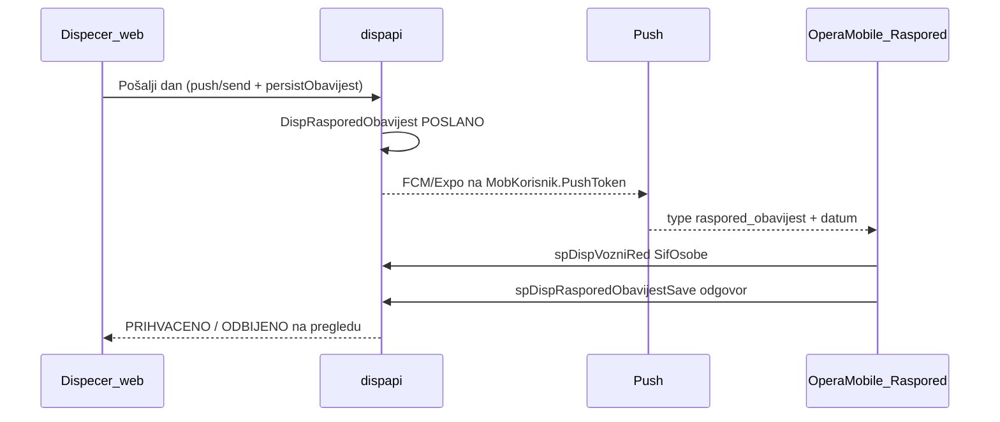

# Slavonija Bus — Opera Mobile app **Raspored**

Datum: 2026-08-07 · Status: **Faza 1 u Expo kodu** (pregled) · Faza 2/3 kasnije · Bez pusha u buildu · Bez EAS

Referenca: Dispečer TFS `main` @ `3ceb123` (“Dorade”, 2026-08), `Dispecer/docs/mobilna-app/mob-korisnik-api.md`, OperaMobile PinApp `raspored-mobile`.

---

## 1. Cilj

Vozač u **Opera Mobile** otključa app **Raspored** i vidi **svoje** vožnje (barem ~7 dana unaprijed). Po vožnji: **vrijeme**, **bus**, **registracija**, **ruta**.

Pun tok (Disp sada ima backend za ovo): dispečer **Pošalji** dan → push → vozač **Prihvati / Odbij** (odbijanje uz obaveznu napomenu). Potvrda je **po danu** (`SifOsobe` × `Datum`), ne po pojedinoj vožnji.

**Nije** JSON/dgl layout. Samo `app.code === 'raspored-mobile'` (tenant `ooSLABUS` / `slabus`).

**Servis** (`servis-mobile`) ostaje standardni JSON put — ovaj dokument ga ne dira.

---

## 2. Što danas postoji

### 2.1 Opera Mobile (Expo)

```
Core PIN → ERP /login → CC (Raspored + Servis) → App PIN → danas: modules/[code] (prazno za raspored)
```

- Produkcijski API: `https://opera.slavonija-bus.hr/dispapi/api`
- Nema grane po `app.code` → treba `/(app)/raspored/...`

### 2.2 Dispečer — **novo u TFS `3ceb123`** (kolega)

| Komponenta | Status |
|---|---|
| Tablica `MobKorisnik` (+ migracija iz `DispVozacPristup`) | SQL + snapshot |
| `spMobKorisnikLogin` / `List` / `Save` (TOKEN, CLEAR_TOKEN) | SQL + snapshot |
| `POST /api/login` s `loginType: "MOB"` (+ opcionalni `pushToken`) | Disp.Gen |
| Tablica `DispRasporedObavijest` (dan × vozač) | SQL + snapshot |
| `spDispRasporedObavijestList` / `Save` (`send` / `odgovor` / `reset`) | SQL + snapshot |
| Web Pregled voznog reda: statusi + **Pošalji** | `vozniRedPotvrde.ts`, `RasporedVozniRedDialog` |
| `POST /api/push/send` (FCM / Expo; `persistObavijest`) | `PushController` / `PushService` |
| Dokumentacija za Expo kolegu | `docs/mobilna-app/mob-korisnik-api.md` |

**Statusi obavijesti:** `NESLANO` (nema retka) → `POSLANO` → `PRIHVACENO` \| `ODBIJENO` (komentar obavezan pri odbijanju).

**Jedinica potvrde:** cijeli dan, ne pojedina stavka vožnje.

### 2.3 Dispečer mobile (`Dispecer/mobile`)

Još stariji ugovor (`spDispVozacLogin`) — Disp docs kažu: **nova Expo app zove samo `spMobKorisnik*`**.

### 2.4 Data contract vožnje (`spDispVozniRed`)

| Potrebno u app | Polje / napomena |
|---|---|
| Vrijeme | `vrijemepolaska`, `vrijemedolaska` |
| Ruta | `nazivlinije`, `odrediste` |
| Registracija | `registracija` (`COALESCE(RegOznaka, SifArt)`) |
| Bus | potvrditi zasebno polje vs dio `registracija` |

### 2.5 Snapshot SQL2022

Referenca: **`ooSLABUS_20260423_NT`** (MCP `disp-sql-2022-readonly`) — potvrđeno ažurno za rad.  
Na snapshotu: `MobKorisnik`, `DispRasporedObavijest`, SP-ovi postoje (`MobKorisnik` ≥1 red; obavijesti trenutno 0).

---

## 3. Ciljni poslovni tok



---

## 4. Auth — stanje i napetost

### 4.1 Što je vlasnik rekao (ranije 2026-08-07)

Opera Mobile lanac ostaje: Core → **ERP `/login`** → CC → App PIN.  
`SifOsobe` za vozni red iz ERP sesije. Bez drugog Disp PIN-a u Fazi 1.

### 4.2 Što Disp sada dokumentira / implementira

Nakon centralnog unlocka: **`POST /api/login`** s `loginType: "MOB"`, `uid`/`pwd` = `MobKorisnik` (korime + PIN).  
**Nije** `auth.Accounts` / ERP SEC login. Push token živi u `MobKorisnik.PushToken`.

### 4.3 Impakt

| Potreba | ERP `sifosobe` (SEC) | `MobKorisnik` (MOB) |
|---|---|---|
| Lista vožnji `spDispVozniRed` | radi ako je isti `SifOsobe` | radi (`user.sifosobe`) |
| Prihvati/Odbij dan | radi s istim `SifOsobe` | radi |
| Push primiti | **ne** — token je na `MobKorisnik` | **da** |
| Servis app (JSON) | treba ERP login + `sifgrupe` | — |

**Otvoreno za odluku vlasnika** (ne pretpostavljati):

- **A (hibrid):** Core + ERP login za CC/Servis; za Raspored dodatno MOB login ili mapiranje ERP→MobKorisnik — teže UX.  
- **B (Disp ugovor):** nakon Core unlocka za Raspored-tok koristiti MOB login (Disp docs). Kako to sjeda uz zajednički CC + Servis ERP login — dogovoriti.  
- **C (Faza 1 bez pusha):** ostati na ERP `sifosobe` za pregled (+ kasnije odgovor); push tek kad `MobKorisnik` + token budu u toku.

Do odluke: **Faza 1 kod** ne uvodi MOB login dok se ne potvrdi; plan ispod razdvaja Fazu 1 (pregled) od Faze 2 (odgovor) i Faze 3 (push).

### 4.4 Laički: kako smo riješili „MOB login“ za Fazu 1

**Problem:** Disp je napravio zaseban mobilni login (`MobKorisnik` + PIN) jer push token ide tamo. To nije isto što ERP login (`svam` itd.).

**Što radimo sada (Faza 1):** vozač se logira **kao i dosad u Opera Mobile** (Core → ERP → App PIN). Raspored uzima **`sifosobe` iz tog ERP logina** i njime zove `spDispVozniRed`. Nema drugog „Disp PIN“ ekrana.

**Što kasnije (push):** treba će `MobKorisnik` + token — to je Faza 3, nije dio pregleda.

**Zašto `svam` prije nije vidio vožnje:** `svam` nije bio vozač u rasporedu. Na test snapshotu `ooSLABUS_20260423_NT` privremeno je `svam` → `SifOsobe=4146` (Zoran Lazović) da se može smoke-testirati. Na produkciji treba pravi ERP korisnik-vozač.

---

## 5. Navigacija u Expo

```
CC → Raspored → App PIN → /(app)/raspored/...   (ne modules/[code])
```

Grana: `apps.tsx`, `app-unlock.tsx`, `(app)/_layout.tsx`.  
JSON / `documents/*` — **ne**.

---

## 6. UX

### 6.1 Tabovi (Faza 1 UI — 2026-08-07)

| Tab | Raspon | Ponašanje |
|---|---|---|
| **Aktualno** | danas … danas+6 (**UI limit 7 dana**) | Hijerarhija po danima; danas otvoren, ostali sklopljeni. Kasnije: push / istaknute nove vožnje / Potvrdi. |
| **Sutra** | samo sutrašnji lokalni dan | Jedan dan, otvoren; prazno → „Još nema rasporeda za sutra.“ |
| **Povijest** | kalendarski tjedan **pon–ned**, max **12** tjedana unazad | Dani sklopljeni; prazan tjedan OK |

**Vremenska zona:** lokalni kalendarski dani uređaja (`YYYY-MM-DD` bez UTC parse) — bez pomaka „−2 h“.

**Vizualno gotovo (samo lokalno, ne API):** vožnja u Aktualno/Sutra postaje siva **30 min nakon** predviđenog dolaska (lokalno), ili swipe **udesno** → „Gotovo“. Ne briše podatak s servera.

### 6.2 Kartica vožnje

1. Vrijeme `HH:mm → HH:mm`  
2. Jedna linija rute (bez duplog naziva)  
3. Registracija / bus (`registracija` iz SP-a)  

### 6.3 Potvrda dana (Faza 2) — na tabu **Aktualno**

**Ugovor (2026-08-07):**
- `spDispRasporedObavijestList` — inbox statusa (`POSLANO` / `PRIHVACENO` / `ODBIJENO`)
- `spDispVozniRed` — vožnje za prikaz
- `spDispRasporedObavijestSave` `Action=odgovor` `Status=PRIHVACENO` — samo **Potvrdi** (bez Odbij u app)

**Aktualno:** gore istaknuti dani `POSLANO` (+ Potvrdi / Potvrdi sve); dolje samo `PRIHVACENO`.  
**Sutra:** samo ako je sutra `PRIHVACENO`; inače poruka (POSLANO → „potvrdi u Aktualno“).  
**Povijest:** bez filtra obavijesti.  
**Push:** Faza 3.

**Jedinica potvrde:** cijeli **dan** (`SifOsobe` × `Datum`).

---

## 7. API ugovor (tenant dispapi)

| Akcija | Endpoint / SP | Faza |
|---|---|---|
| Lista vožnji | `spDispVozniRed` (`DatumOd`, `DatumDo`, `SifOsobe`) | 1 |
| Statusi dana | `spDispRasporedObavijestList` | 2 (opcionalno već u 1 za badge) |
| Odgovor | `spDispRasporedObavijestSave` `odgovor` | 2 |
| MOB login | `POST /api/login` `loginType=MOB` | odluka §4 / za push |
| Push token | login `pushToken` ili `spMobKorisnikSave` `TOKEN` | 3 |
| Pošalji (web) | `POST /api/push/send` + persist | Disp web — **gotovo** |

Runtime `db`: produkcija `ooSLABUS`; lokalni smoke SQL: `ooSLABUS_20260423_NT`.

---

## 8. Što mora Disp / backend — **ažurirano**

| Stavka | Prije | Sada |
|---|---|---|
| Status poslano/prihvaćeno/odbijeno | nedostajalo | **`DispRasporedObavijest` + SP** |
| Pošalji s weba | nedostajalo | **UI + `/api/push/send`** |
| Push infrastruktura API | nedostajalo | **`PushService` (FCM/Expo)** |
| Mobilni identity + token | `DispVozacPristup` | **`MobKorisnik`** |
| Expo klijent (Opera Mobile Raspored) | — | **još treba** |
| Deploy SP/tablica na produkcijski tenant | — | potvrditi na live `ooSLABUS` (snapshot već ima) |
| Firebase credentials na dispapi | — | server ops |

---

## 9. Granice

- Ne JSON layout za Raspored  
- `Dispecer/` = referenca; ne commitati kao dio Opera Mobile; port ugovora u `expo/`  
- Ne generički push za sve tenante  
- Ne EAS/store dok vlasnik ne odobri  
- Auth Opera Mobile globalno ne refaktorirati bez odluke §4  

---

## 10. SQL / MCP

- Razvoj/analiza: **`ooSLABUS_20260423_NT`** @ SQL2022  
- Produkcijski host `SLAVBUS` / `ooSLAVBUS` — zanemariti dok nije potreban  

### Test login (snapshot, 2026-08-07)

| Korak | Vrijednost |
|---|---|
| Core PIN | `slabus00` ili `slabus01` |
| ERP | `svam` (na NT: `SifOsobe=4146` radi smoke) |
| App PIN Raspored | `slabr000` / `slabr001` |
| App PIN Servis | `slabus00` / `slabus01` |

Vožnje na snapshotu su u **prošlosti** (do ~srpnja) → u app otvori **Povijest** i idi ‹ unazad. Nadolazeće može biti prazno.

---

## 11. Otvorena pitanja

1. **Auth A/B/C** (§4) — kritično prije Faze 2/3 i prije MOB logina u Expo  
2. **Potvrda: samo Potvrdi (Josip) vs Prihvati/Odbij (Sanja)** (§6.3) — treba SB/Svam odluka prije Faze 2 UI  
3. Bus vs registracija polje u `spDispVozniRed`  
4. Ostaje li zasebni `Dispecer/mobile` u prod ili ga Opera Raspored zamjenjuje  
5. Smoke: koji ERP user / `SifOsobe` ima vožnje za test  
6. Disp web: preklapanje autobusa (Ana-Marija) — izvan Opera Mobile scope

---

## 12. Redoslijed implementacije (dotjerano)

1. **Faza 1 — pregled** — **implementirano u Expo** (`expo/app/(app)/raspored`, `features/raspored`, grana u `apps.tsx` / `app-unlock.tsx`). Identitet: ERP `sifosobe`.  
2. **Faza 2 — potvrda dana:** UI prema **finalnoj SB odluci** (§6.3) + `spDispRasporedObavijestList`/`Save`; badge statusa.  
3. **Faza 3 — push** (zasebno odobrenje): `MobKorisnik` token + deep link `raspored_obavijest`; uskladiti auth s Disp ugovorom.  
4. Ne dirati Disp web Pošalji — već u Dispečeru (eventualno sakriti Odbij na webu ako SB odluči samo Potvrdi).

---

## Documentation impact

- Ovaj dokument = izvor istine za SB Raspored u Opera Mobile  
- Nakon odluke §4 → `DECISION_LOG.md`  
- `V2_BACKLOG`: push ostaje SB-specifičan  
- Disp referenca: `Dispecer/docs/mobilna-app/mob-korisnik-api.md`
